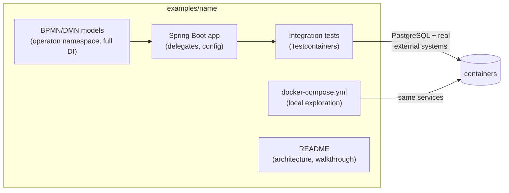

# Operaton Example Projects

A curated catalog of comprehensive, end-to-end use-case applications built on
[Operaton](https://operaton.org) — the open-source BPMN process engine.
Every project is self-contained, builds with **both** Maven Wrapper and
Gradle Wrapper, ships a Docker Compose setup for local exploration, and is
verified end-to-end by **Testcontainers** integration tests: building a
project means testing its processes against real integrations.

## Requirements

| Tool | Version |
|---|---|
| JDK | 21 |
| Docker | any recent version (required for tests and local run) |
| Distribution images (`operaton/tomcat`, `operaton/wildfly`, `operaton/operaton`) | `2.1.1` |

Pinned stack (all projects): Spring Boot **4.1.0**, Operaton **2.1.1**,
Maven Wrapper **3.9.12**, Gradle Wrapper **9.5.1**, PostgreSQL **16**.

## Using a project

```bash
cd examples/<project-name>
docker compose up -d --wait # start PostgreSQL (and project-specific services)
./mvnw spring-boot:run      # or: ./gradlew bootRun
# Cockpit/Tasklist: http://localhost:8080  (demo/demo)
./mvnw verify               # or: ./gradlew build — runs Testcontainers ITs
```

## Catalog

| Project | Business Use Case |
|---|---|
| *(first project coming soon)* | |

## Anatomy of every project



## Quality bar

Every project satisfies [docs/EXAMPLE_STANDARDS.md](docs/EXAMPLE_STANDARDS.md)
— the definition of done covering modeling, testing, documentation and dual
builds. CI builds every project with both build systems on every push.

## Contributing (humans and AI agents)

AI agents: start with [AGENTS.md](AGENTS.md).
Humans: same rules — see the review checklist in
[docs/EXAMPLE_STANDARDS.md](docs/EXAMPLE_STANDARDS.md#10-review-checklist-copy-into-every-project-pr).

## License

[Apache-2.0](LICENSE)
