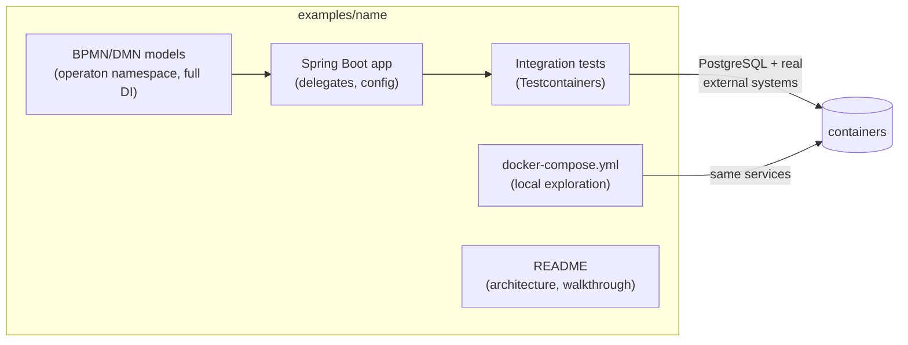

# Repository Setup Implementation Plan

> **For agentic workers:** REQUIRED SUB-SKILL: Use superpowers:subagent-driven-development (recommended) or superpowers:executing-plans to implement this plan task-by-task. Steps use checkbox (`- [ ]`) syntax for tracking.

**Goal:** Establish the full repository infrastructure for `operaton-example-projects` so that adding the first example project requires only creating its directory and registering it in the build aggregator.

**Architecture:** Pure file-creation tasks — no application code. The root build is a Maven + Gradle aggregator with an empty module list, CI workflow with change-detection identical to `operaton-examples`, and adapted documentation targeting comprehensive use-case projects rather than single-concept demonstrations.

**Tech Stack:** Maven 3.9.12, Gradle 9.5.1, GitHub Actions, YAML

**Source repo for copies:** `/Users/kthoms/Development/git/operaton/operaton-examples`

## Global Constraints

- groupId: `org.operaton.examples` (exactly — no deviation)
- artifactId: `operaton-example-projects-aggregate`
- Operaton namespace: `http://operaton.org/schema/1.0/bpmn` with `operaton:` prefix (never `camunda`)
- Pinned stack (recorded in README version table): JDK 21, Spring Boot 4.1.0, Operaton 2.1.1, Maven Wrapper 3.9.12, Gradle Wrapper 9.5.1, PostgreSQL 16, Distribution images 2.1.1
- Working directory for all commands: `/Users/kthoms/Development/git/operaton/operaton-example-projects`
- Source for binary wrapper files: `/Users/kthoms/Development/git/operaton/operaton-examples`

---

### Task 1: Root config files and empty examples folder

**Files:**
- Create: `.gitignore`
- Create: `.editorconfig`
- Create: `examples/.gitkeep`

**Interfaces:**
- Produces: nothing consumed by other tasks; all later files live in the same repo

- [ ] **Step 1: Create `.gitignore`**

```
# Build output
target/
build/
out/

# IDE
.idea/
*.iml
.vscode/
.settings/
.classpath
.project

# OS
.DS_Store

# Gradle/Maven local state
.gradle/

# Local env overrides
.env

docs/superpowers/plans

# Git worktrees
.worktrees/
```

- [ ] **Step 2: Create `.editorconfig`**

```ini
root = true

[*]
charset = utf-8
end_of_line = lf
insert_final_newline = true
trim_trailing_whitespace = true
indent_style = space
indent_size = 4

[*.{yml,yaml,json,xml,md,gradle.kts}]
indent_size = 2

[*.bpmn]
indent_size = 2
```

- [ ] **Step 3: Create `examples/.gitkeep`**

Empty file — keeps the `examples/` directory tracked by Git before any project is added.

```bash
mkdir -p examples && touch examples/.gitkeep
```

- [ ] **Step 4: Verify files exist**

```bash
ls -la .gitignore .editorconfig examples/.gitkeep
```

Expected: all three files listed, no errors.

- [ ] **Step 5: Commit**

```bash
git add .gitignore .editorconfig examples/.gitkeep
git commit -m "chore: add root config files and empty examples folder"
```

---

### Task 2: Build wrappers

**Files:**
- Copy: `mvnw` (binary from source repo)
- Copy: `mvnw.cmd` (binary from source repo)
- Copy: `.mvn/wrapper/maven-wrapper.jar`
- Copy: `.mvn/wrapper/maven-wrapper.properties`
- Copy: `gradlew` (binary from source repo)
- Copy: `gradlew.bat` (binary from source repo)
- Copy: `gradle/wrapper/gradle-wrapper.jar`
- Copy: `gradle/wrapper/gradle-wrapper.properties`

**Interfaces:**
- Produces: `./mvnw` and `./gradlew` executables consumed by Task 3 verification steps

- [ ] **Step 1: Copy Maven Wrapper files**

```bash
SRC=/Users/kthoms/Development/git/operaton/operaton-examples
cp "$SRC/mvnw" "$SRC/mvnw.cmd" .
mkdir -p .mvn/wrapper
cp "$SRC/.mvn/wrapper/maven-wrapper.jar" \
   "$SRC/.mvn/wrapper/maven-wrapper.properties" \
   .mvn/wrapper/
chmod +x mvnw
```

- [ ] **Step 2: Copy Gradle Wrapper files**

```bash
SRC=/Users/kthoms/Development/git/operaton/operaton-examples
cp "$SRC/gradlew" "$SRC/gradlew.bat" .
mkdir -p gradle/wrapper
cp "$SRC/gradle/wrapper/gradle-wrapper.jar" \
   "$SRC/gradle/wrapper/gradle-wrapper.properties" \
   gradle/wrapper/
chmod +x gradlew
```

- [ ] **Step 3: Verify wrapper executables**

```bash
./mvnw --version
```

Expected output contains: `Apache Maven 3.9.12`

```bash
./gradlew --version
```

Expected output contains: `Gradle 9.5.1`

- [ ] **Step 4: Commit**

```bash
git add mvnw mvnw.cmd .mvn/ gradlew gradlew.bat gradle/
git commit -m "chore: add Maven and Gradle wrappers"
```

---

### Task 3: Build aggregator

**Files:**
- Create: `pom.xml`
- Create: `settings.gradle.kts`
- Create: `build.gradle.kts`

**Interfaces:**
- Produces: working aggregator build consumed by CI; individual examples will add themselves to `<modules>` and `include()` lists here

- [ ] **Step 1: Create `pom.xml`**

```xml
<?xml version="1.0" encoding="UTF-8"?>
<project xmlns="http://maven.apache.org/POM/4.0.0"
         xmlns:xsi="http://www.w3.org/2001/XMLSchema-instance"
         xsi:schemaLocation="http://maven.apache.org/POM/4.0.0 https://maven.apache.org/xsd/maven-4.0.0.xsd">
  <modelVersion>4.0.0</modelVersion>

  <groupId>org.operaton.examples</groupId>
  <artifactId>operaton-example-projects-aggregate</artifactId>
  <version>0.1.0-SNAPSHOT</version>
  <packaging>pom</packaging>
  <name>Operaton Example Projects — Aggregator</name>

  <modules>
  </modules>

  <build>
    <pluginManagement>
      <plugins>
        <plugin>
          <groupId>org.apache.maven.plugins</groupId>
          <artifactId>maven-failsafe-plugin</artifactId>
          <version>3.5.6</version>
          <executions>
            <execution>
              <goals>
                <goal>integration-test</goal>
                <goal>verify</goal>
              </goals>
            </execution>
          </executions>
        </plugin>
      </plugins>
    </pluginManagement>
  </build>

  <profiles>
    <profile>
      <id>rancher</id>
      <activation>
        <file>
          <exists>${user.home}/.rd/docker.sock</exists>
        </file>
      </activation>
      <build>
        <pluginManagement>
          <plugins>
            <plugin>
              <groupId>org.apache.maven.plugins</groupId>
              <artifactId>maven-failsafe-plugin</artifactId>
              <configuration>
                <environmentVariables>
                  <DOCKER_HOST>unix://${user.home}/.rd/docker.sock</DOCKER_HOST>
                  <TESTCONTAINERS_DOCKER_SOCKET_OVERRIDE>/var/run/docker.sock</TESTCONTAINERS_DOCKER_SOCKET_OVERRIDE>
                  <TESTCONTAINERS_RYUK_DISABLED>true</TESTCONTAINERS_RYUK_DISABLED>
                </environmentVariables>
              </configuration>
            </plugin>
          </plugins>
        </pluginManagement>
      </build>
    </profile>
  </profiles>

</project>
```

- [ ] **Step 2: Create `settings.gradle.kts`**

```kotlin
rootProject.name = "operaton-example-projects-aggregate"
```

- [ ] **Step 3: Create `build.gradle.kts`**

```kotlin
group = "org.operaton.examples"
version = "0.1.0-SNAPSHOT"

subprojects {
    repositories {
        mavenCentral()
    }
}
```

- [ ] **Step 4: Verify Maven build**

```bash
./mvnw validate
```

Expected: `BUILD SUCCESS` (validates POM structure, no compilation needed)

- [ ] **Step 5: Verify Gradle build**

```bash
./gradlew help --no-daemon
```

Expected: `BUILD SUCCESSFUL` — prints help text, confirms settings load correctly.

- [ ] **Step 6: Commit**

```bash
git add pom.xml settings.gradle.kts build.gradle.kts
git commit -m "chore: add build aggregator (Maven + Gradle, no modules yet)"
```

---

### Task 4: GitHub configuration

**Files:**
- Create: `.github/workflows/ci.yml`
- Create: `.github/workflows/auto-merge.yml` (copy verbatim)
- Create: `.github/auto-merge.config.yml` (copy verbatim)
- Create: `.github/dependabot.yml` (copy verbatim)

**Interfaces:**
- Produces: CI that auto-discovers changed examples and builds them; Dependabot for dependency updates

- [ ] **Step 1: Create `.github/workflows/ci.yml`**

```bash
mkdir -p .github/workflows
```

File content — identical logic to `operaton-examples/ci.yml` except the Gradle whitelist starts empty:

```yaml
name: CI

on:
  push:
    branches: [main]
  pull_request:

concurrency:
  group: "${{ github.workflow }}-${{ github.ref }}"
  cancel-in-progress: true

jobs:
  discover:
    runs-on: ubuntu-latest
    outputs:
      maven-examples: ${{ steps.discover.outputs.maven }}
      gradle-examples: ${{ steps.discover.outputs.gradle }}
    steps:
      - uses: actions/checkout@v6
        with:
          fetch-depth: 0

      - id: discover
        run: |
          if [ "${{ github.event_name }}" == "pull_request" ]; then
            base_ref="origin/${{ github.base_ref }}"
          else
            base_ref="origin/main"
          fi

          # Extract project paths relative to examples/:
          # - examples/my-project/... -> my-project
          # - examples/use-cases/leave-request/... -> use-cases/leave-request
          changed=$(git diff --name-only --diff-filter=d "$base_ref" 2>/dev/null \
            | grep '^examples/' \
            | awk -F'/' '{
                if ($2 == "use-cases" && NF >= 3) print $2"/"$3
                else if ($2 != "" && $2 != "use-cases") print $2
              }' \
            | sort -u | jq -R . | jq -cs . 2>/dev/null || echo "[]")

          # Fall back to all examples when nothing changed (fresh push / workflow change)
          if [ "$changed" = "[]" ]; then
            changed=$(find examples -name "mvnw" -mindepth 2 -maxdepth 3 \
              | sed 's|^examples/||' | sed 's|/mvnw$||' \
              | sort -u | jq -R . | jq -cs .)
          fi

          echo "Changed: $changed"

          # Maven: all changed examples (every project has mvnw)
          maven=$(printf '%s' "$changed")
          echo "maven=$maven" >> "$GITHUB_OUTPUT"
          echo "Maven: $maven"

          # Gradle: only whitelisted examples that were changed
          gradle_whitelist='[]'
          gradle=$(printf '%s' "$changed" | jq -c \
            --argjson wl "$gradle_whitelist" \
            '[.[] | select(. as $e | $wl | any(. == $e))]')
          echo "gradle=$gradle" >> "$GITHUB_OUTPUT"
          echo "Gradle: $gradle"

  build-maven:
    needs: discover
    if: needs.discover.outputs.maven-examples != '[]'
    runs-on: ubuntu-latest
    strategy:
      fail-fast: false
      matrix:
        example: ${{ fromJson(needs.discover.outputs.maven-examples) }}
    name: ${{ matrix.example }} (maven)
    steps:
      - uses: actions/checkout@v6
      - uses: actions/setup-java@v5
        with:
          distribution: temurin
          java-version: 21
          cache: maven
      - name: Build and test (Maven)
        working-directory: examples/${{ matrix.example }}
        run: ./mvnw -B -ntp verify

  build-gradle:
    needs: discover
    if: needs.discover.outputs.gradle-examples != '[]'
    runs-on: ubuntu-latest
    strategy:
      fail-fast: false
      matrix:
        example: ${{ fromJson(needs.discover.outputs.gradle-examples) }}
    steps:
      - uses: actions/checkout@v6
      - uses: actions/setup-java@v5
        with:
          distribution: temurin
          java-version: 21
          cache: gradle
      - name: Build and test (Gradle)
        working-directory: examples/${{ matrix.example }}
        run: ./gradlew build --no-daemon
```

- [ ] **Step 2: Copy `auto-merge.yml` verbatim**

```bash
cp /Users/kthoms/Development/git/operaton/operaton-examples/.github/workflows/auto-merge.yml \
   .github/workflows/auto-merge.yml
```

- [ ] **Step 3: Copy `auto-merge.config.yml` verbatim**

```bash
cp /Users/kthoms/Development/git/operaton/operaton-examples/.github/auto-merge.config.yml \
   .github/auto-merge.config.yml
```

- [ ] **Step 4: Copy `dependabot.yml` verbatim**

```bash
cp /Users/kthoms/Development/git/operaton/operaton-examples/.github/dependabot.yml \
   .github/dependabot.yml
```

- [ ] **Step 5: Verify YAML syntax**

```bash
python3 -c "
import yaml, sys
for f in [
  '.github/workflows/ci.yml',
  '.github/workflows/auto-merge.yml',
  '.github/auto-merge.config.yml',
  '.github/dependabot.yml',
]:
    yaml.safe_load(open(f))
    print(f'OK: {f}')
"
```

Expected: four `OK:` lines, no exceptions.

- [ ] **Step 6: Commit**

```bash
git add .github/
git commit -m "ci: add CI workflow, auto-merge, and Dependabot config"
```

---

### Task 5: Scripts

**Files:**
- Create: `scripts/render-bpmn.sh`

**Interfaces:**
- Produces: BPMN-to-PNG renderer used by every project's README instructions

- [ ] **Step 1: Create `scripts/render-bpmn.sh`**

```bash
mkdir -p scripts
```

File content (identical to `operaton-examples/scripts/render-bpmn.sh`):

```bash
#!/usr/bin/env bash
# Render all BPMN files to PNG using bpmn-to-image (https://github.com/bpmn-io/bpmn-to-image)
#
# Prerequisites: npm install -g bpmn-to-image
#
# Usage:
#   ./scripts/render-bpmn.sh            # render all BPMN files
#   ./scripts/render-bpmn.sh <pattern>  # render only files matching grep pattern
set -euo pipefail

if ! command -v bpmn-to-image &>/dev/null; then
  echo "ERROR: bpmn-to-image not found. Install with:"
  echo "  npm install -g bpmn-to-image"
  exit 1
fi

pattern="${1:-}"
root="$(cd "$(dirname "$0")/.." && pwd)"
count=0

while IFS= read -r bpmn; do
  [[ -n "$pattern" && "$bpmn" != *"$pattern"* ]] && continue
  png="${bpmn%.bpmn}.png"
  echo "  → ${bpmn#"$root/"}"
  bpmn-to-image "$bpmn:$png"
  count=$((count + 1))
done < <(find "$root" \
  -name "*.bpmn" \
  -not -path "*/.git/*" \
  -not -path "*/target/*" \
  -not -path "*/build/*" \
  -not -path "*/.gradle/*" \
  -not -path "*/.worktrees/*" \
  -not -path "*/.claude/*" \
  | sort)

echo "Rendered $count diagram(s)."
```

- [ ] **Step 2: Make executable and verify syntax**

```bash
chmod +x scripts/render-bpmn.sh
bash -n scripts/render-bpmn.sh
```

Expected: no output (bash -n only reports syntax errors).

- [ ] **Step 3: Commit**

```bash
git add scripts/render-bpmn.sh
git commit -m "chore: add render-bpmn.sh script"
```

---

### Task 6: Documentation

**Files:**
- Create: `README.md`
- Create: `CLAUDE.md`
- Create: `AGENTS.md`
- Create: `docs/EXAMPLE_STANDARDS.md`
- Create: `.operaton-starter.yml`

**Interfaces:**
- Produces: all human/agent-facing documentation; `.operaton-starter.yml` consumed by the operaton-starter tooling

- [ ] **Step 1: Create `README.md`**

```markdown
# Operaton Example Projects

A curated catalog of comprehensive, end-to-end use-case applications built on
[Operaton](https://operaton.org) — the open-source BPMN process engine.
Every project is self-contained, builds with **both** Maven Wrapper and
Gradle Wrapper, ships a Docker Compose setup for local exploration, and is
verified end-to-end by **Testcontainers** integration tests: building a
project means testing its processes against real integrations.

## Requirements

| Tool | Version |
|---|---|
| JDK | 21 |
| Docker | any recent version (required for tests and local run) |
| Distribution images (`operaton/tomcat`, `operaton/wildfly`, `operaton/operaton`) | `2.1.1` |

Pinned stack (all projects): Spring Boot **4.1.0**, Operaton **2.1.1**,
Maven Wrapper **3.9.12**, Gradle Wrapper **9.5.1**, PostgreSQL **16**.

## Using a project

```bash
cd examples/<project-name>
docker compose up -d --wait # start PostgreSQL (and project-specific services)
./mvnw spring-boot:run      # or: ./gradlew bootRun
# Cockpit/Tasklist: http://localhost:8080  (demo/demo)
./mvnw verify               # or: ./gradlew build — runs Testcontainers ITs
```

## Catalog

| Project | Business Use Case |
|---|---|
| *(first project coming soon)* | |

## Anatomy of every project



## Quality bar

Every project satisfies [docs/EXAMPLE_STANDARDS.md](docs/EXAMPLE_STANDARDS.md)
— the definition of done covering modeling, testing, documentation and dual
builds. CI builds every project with both build systems on every push.

## Contributing (humans and AI agents)

AI agents: start with [AGENTS.md](AGENTS.md).
Humans: same rules — see the review checklist in
[docs/EXAMPLE_STANDARDS.md](docs/EXAMPLE_STANDARDS.md#10-review-checklist-copy-into-every-project-pr).

## License

[Apache-2.0](LICENSE)
```

- [ ] **Step 2: Create `CLAUDE.md`**

```markdown
# CLAUDE.md

Read and follow `AGENTS.md` and `docs/EXAMPLE_STANDARDS.md` before any work
in this repository. They define binding quality gates for all projects.
```

- [ ] **Step 3: Create `AGENTS.md`**

```markdown
# AI Agent Guidelines — operaton-example-projects

You are working in a catalog of comprehensive Operaton use-case applications.
Quality bar: every project must be bullet-proof — building it means testing
its processes against real integrations. Read `docs/EXAMPLE_STANDARDS.md`
before writing anything; it is the binding definition of done.

## Non-negotiable rules

1. **Standards first.** `docs/EXAMPLE_STANDARDS.md` overrides your defaults.
   If a request conflicts with it, surface the conflict instead of silently
   deviating.
2. **Reference project.** The first project added to `examples/` is the
   canonical shape. When in doubt about structure, build files, test style,
   README layout, or BPMN conventions — mirror it.
3. **Operaton, not Camunda.** Dependencies are `org.operaton.*`; BPMN/DMN
   extension namespace is `http://operaton.org/schema/1.0/bpmn` with the
   `operaton:` prefix. When porting from Camunda 7 examples, translate every
   `camunda` occurrence; grep for `camunda` before finishing — the result
   must be empty.
4. **Dual build parity.** Any dependency or version change must be applied to
   BOTH `pom.xml` and `build.gradle.kts`, then verified with BOTH
   `./mvnw verify` and `./gradlew build`. Never claim success without having
   run both.
5. **Testcontainers, real systems.** Integration tests start PostgreSQL and
   every integrated external system as containers. Never substitute H2 or an
   in-process fake for the system the project is about.
6. **TDD per project.** Write the failing integration test (deploy → run →
   assert end state) before implementing delegates/configuration.
7. **Minimalism.** Before finishing, actively remove: unused dependencies,
   dead code, gratuitous abstraction layers, configuration that restates
   defaults.
8. **Evidence before claims.** Paste the tail of the passing build output in
   your summary. "Should work" is a failure state.

## Workflow for a new project

1. Read `docs/EXAMPLE_STANDARDS.md` and, once one exists, the reference project.
2. Check the Roadmap section of the repository plan (docs/superpowers/plans/)
   for the project's defined scope and acceptance criteria.
3. Copy the reference project's wrapper files and build-file skeletons;
   adjust artifactId/package.
4. Model the BPMN/DMN first (with DI), then write the failing IT, then
   implement.
5. Write README last, against the running project (commands you actually ran).
6. Run the full review checklist from EXAMPLE_STANDARDS.md §10.

## Pinned versions

Defined in the root README version table. Never bump a version in a single
project; version bumps are repo-wide changes touching all projects.
```

- [ ] **Step 4: Create `docs/EXAMPLE_STANDARDS.md`**

```markdown
# Example Standards — Definition of Done

Every project in this repository MUST satisfy every item below. There are no
exceptions. A project that fails one checklist item is not mergeable.

All numbered sections are binding. The checklist in §10 is a working summary,
not a substitute — passing the checklist does not waive any section.

## 1. Scope

- A project demonstrates **one complete business use case** (named in the
  README's first sentence). Multiple BPMN processes, integrations, and actors
  are expected and encouraged when the use case requires them.
- Minimal: no code, dependency, or model element that does not serve the
  demonstrated use case. If a class can be deleted and the project still
  demonstrates its use case, delete it.
- Self-contained: a project never depends on another project or on a shared
  parent module. Copy, don't share — projects are deployed in isolation.

## 2. Project structure

```
examples/<kebab-case-name>/
├── mvnw, mvnw.cmd, .mvn/wrapper/          # Maven Wrapper (committed)
├── pom.xml
├── gradlew, gradlew.bat, gradle/wrapper/  # Gradle Wrapper (committed)
├── build.gradle.kts, settings.gradle.kts
├── docker-compose.yml                     # only the services this project needs
├── README.md
└── src/
    ├── main/java/org/operaton/examples/<name>/
    ├── main/resources/                    # *.bpmn, *.dmn, application.yaml
    └── test/java/org/operaton/examples/<name>/
```

- Directory name: `kebab-case` (no ordinal prefix — projects have no prescribed reading order).
- Java package: `org.operaton.examples.<name>` where `<name>` is
  the directory name with hyphens removed (`order-fulfillment` → `orderfulfillment`).
- Maven coordinates: groupId `org.operaton.examples`,
  artifactId = directory name, version `0.1.0-SNAPSHOT`.

## 3. Dual build — Maven AND Gradle

- `./mvnw verify` and `./gradlew build` MUST both succeed from a clean
  checkout with only JDK 21 and Docker installed.
- Both builds compile the same `src/` tree and run the same tests. Gradle's
  `test` task discovers `*IT` classes via the JUnit Platform regardless of
  name; Maven runs them ONLY through failsafe — therefore `pom.xml` MUST
  declare `maven-failsafe-plugin` with the `integration-test` and `verify`
  goals. A green `./mvnw verify` that executed zero ITs is a broken build:
  reviewers check failsafe's `Tests run:` count is > 0.
- Versions (Java, Spring Boot, Operaton) MUST be identical in `pom.xml` and
  `build.gradle.kts`, and MUST match the table in the root README — the single source of truth for pinned versions.
- Dependency management via BOMs only: `spring-boot-dependencies` /
  `SpringBootPlugin.BOM_COORDINATES` plus `org.operaton.bpm:operaton-bom`.
  Never pin a version that a BOM already manages.

## 4. BPMN / DMN models

- Executable semantics use
  `xmlns:operaton="http://operaton.org/schema/1.0/bpmn"` — never the
  `camunda` namespace.
- Every process: `operaton:historyTimeToLive` set (default `P30D`),
  `isExecutable="true"`, process `id` in kebab-case matching the file name.
- Every element has a meaningful `name` (verb-object for tasks: "Submit loan
  application"). Sequence flows out of gateways are named with their
  condition ("approved", "rejected", "pending review").
- Diverging exclusive gateways: every non-default outgoing flow has a
  `conditionExpression`; exactly one default flow is marked.
- Models include full BPMN DI (`bpmndi:BPMNDiagram`).
- User tasks use `operaton:candidateGroups` (not hard-coded assignees).
- Service tasks use `operaton:delegateExpression="${beanName}"` referencing a
  Spring bean, unless the project demonstrates otherwise.
- DMN: decision `id` in kebab-case matching the file name; hit policy is
  a deliberate choice explained in the README.

## 5. Testing — Testcontainers, end-to-end

- Integration tests are named `*IT` and live in `src/test/java`.
- Every IT class runs against **PostgreSQL via Testcontainers**
  (`@Testcontainers` + `@Container` + `@ServiceConnection`). H2 is forbidden
  in integration tests.
- External systems the project integrates with are ALSO started via
  Testcontainers — the test must exercise the real integration.
- Tests execute the process end-to-end: deploy → start → drive through wait
  states → assert it ended in the expected end event.
- Both happy path and at least one alternative/error path are tested.
- No `Thread.sleep` — use Awaitility for asynchronous continuations.
- `./mvnw verify` runs the ITs via failsafe; `./gradlew build` runs them via
  the standard `test` task.

## 6. Docker Compose (local exploration)

- `docker-compose.yml` contains exactly the services needed to run the
  project locally (always PostgreSQL; plus the project's external systems).
- Every service has a `healthcheck`; dependent services use
  `depends_on: condition: service_healthy`.
- Fixed, documented host ports; credentials are throwaway dev values stated
  in the README.
- `docker compose up -d` followed by `./mvnw spring-boot:run` MUST work with
  zero manual configuration.

## 7. Application conventions

- Spring Boot 4, single `@SpringBootApplication` class named
  `<Name>Application`.
- `application.yaml` (not `.properties`); datasource points at the
  docker-compose PostgreSQL; an admin user `demo/demo` is configured via
  `operaton.bpm.admin-user`.
- Additional users/groups seeded idempotently, using human names (`alice`,
  `bob`), never `user1`.
- Delegates are complete, runnable implementations — never stubs that log
  "TODO".

## 8. Documentation

Every project README contains, in this order:

1. **Title + business context** — what real-world problem this solves.
2. **What this project demonstrates** — 3–7 bullets.
3. **Architecture overview** — components, integrations, actors (prose or
   diagram).
4. **Process models** — one PNG per BPMN, rendered via `scripts/render-bpmn.sh`
   and referenced as ``. Commit the
   PNG alongside the README. Register the PNG path in `.operaton-starter.yml`
   under `screenshots`. Prerequisites: `npm install -g bpmn-to-image`.
5. **Prerequisites** — JDK 21, Docker; exact versions.
6. **Run it** — `docker compose up -d`, then both `./mvnw spring-boot:run`
   and `./gradlew bootRun`; URLs and credentials (http://localhost:8080,
   demo/demo).
7. **Walk through it** — full scenario narrative covering the happy path and
   at least one alternative/error path (Tasklist clicks and/or curl commands).
8. **How it works** — prose linking architecture elements to code (file links,
   not code dumps).
9. **Run the tests** — `./mvnw verify` and `./gradlew build`; one sentence on
   what the ITs prove.

## 9. Quality gate (CI)

- CI builds every project with BOTH wrappers on every push/PR; a red project
  blocks merge.
- Adding a project = adding its directory and registering it in the root
  `pom.xml` and `settings.gradle.kts`; CI discovers it automatically.

## 10. Review checklist (copy into every project PR)

```
- [ ] ./mvnw verify passes from clean checkout (failsafe ran > 0 ITs)
- [ ] ./gradlew build passes from clean checkout
- [ ] docker compose up -d && ./mvnw spring-boot:run works, Cockpit reachable
- [ ] BPMN/DMN use operaton namespace, have DI, names, historyTimeToLive
- [ ] ITs use Testcontainers (PostgreSQL + real integrations), no H2, no sleeps
- [ ] Happy path + alternative path tested end-to-end
- [ ] README has all 9 sections; PNGs rendered via render-bpmn.sh and referenced
- [ ] Versions match pom.xml == build.gradle.kts == root README table
- [ ] §7 app conventions: demo/demo admin user, named seed users, application.yaml
- [ ] No dead code, no unused dependencies, no TODO/stub delegates
```
```

- [ ] **Step 5: Create `.operaton-starter.yml`**

```yaml
apiVersion: operaton-starter/v1

repository:
  name: "Operaton Example Projects"
  description: "Comprehensive, end-to-end use-case applications built on Operaton — the open-source BPMN process engine."
  maintainer:
    name: "Karsten Thoms"
    url: "https://github.com/kthoms"

examples:
```

- [ ] **Step 6: Verify all docs exist**

```bash
ls README.md CLAUDE.md AGENTS.md docs/EXAMPLE_STANDARDS.md .operaton-starter.yml
```

Expected: all five files listed, no errors.

- [ ] **Step 7: Commit**

```bash
git add README.md CLAUDE.md AGENTS.md docs/EXAMPLE_STANDARDS.md .operaton-starter.yml
git commit -m "docs: add README, AGENTS, CLAUDE, EXAMPLE_STANDARDS, operaton-starter"
```

---

## Self-Review Notes

- **Spec coverage:** All sections of the design spec (structure, build, CI, docs) are covered by Tasks 1–6.
- **No placeholders:** All file contents are complete and literal; no TBDs.
- **Type consistency:** No code types involved — pure file creation. File paths are consistent across tasks.
- **Gradle whitelist** in `ci.yml` is `[]` as specified; will grow when first project adds Gradle support.
- **`docs/EXAMPLE_STANDARDS.md`** triple-backtick blocks inside the markdown content are intentional (showing code blocks within the standards doc); write the file carefully to avoid nesting issues.
- **`.operaton-starter.yml`** `examples:` key has an empty value (no list items yet) — this is valid YAML.
